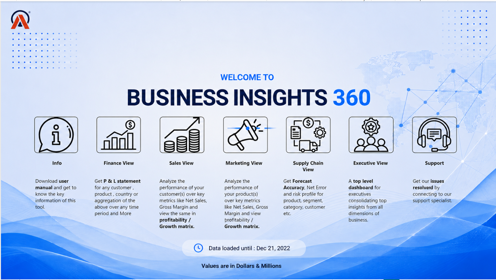
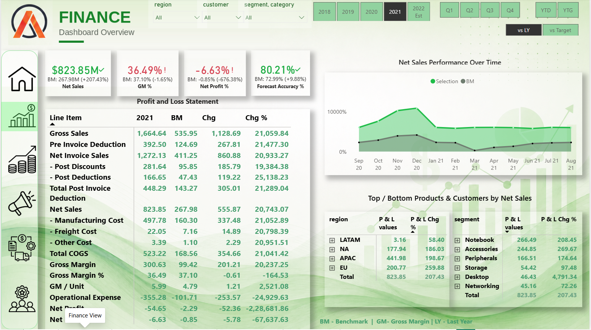
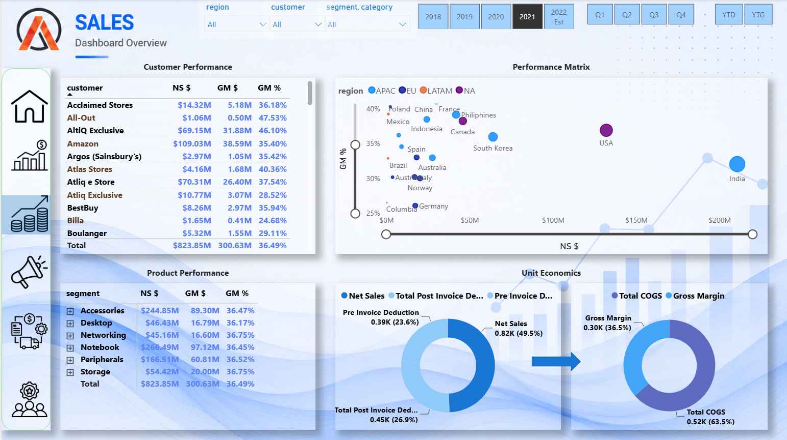
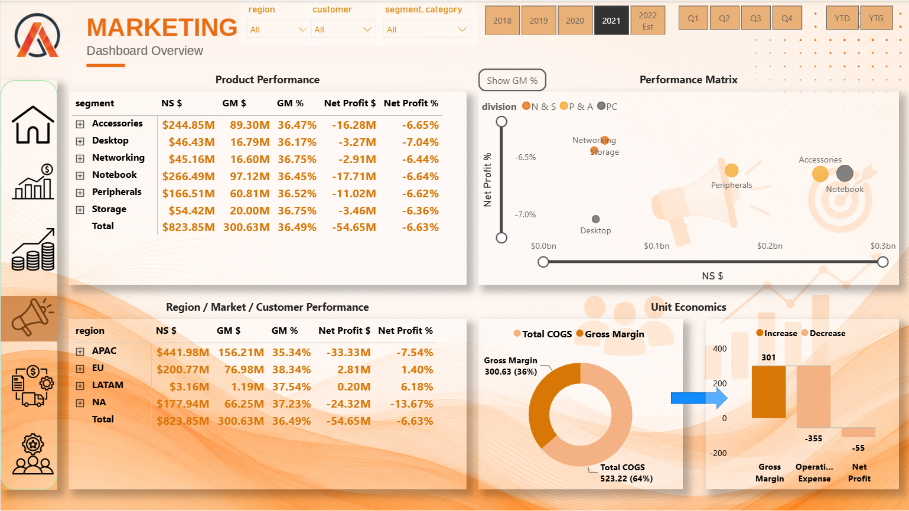
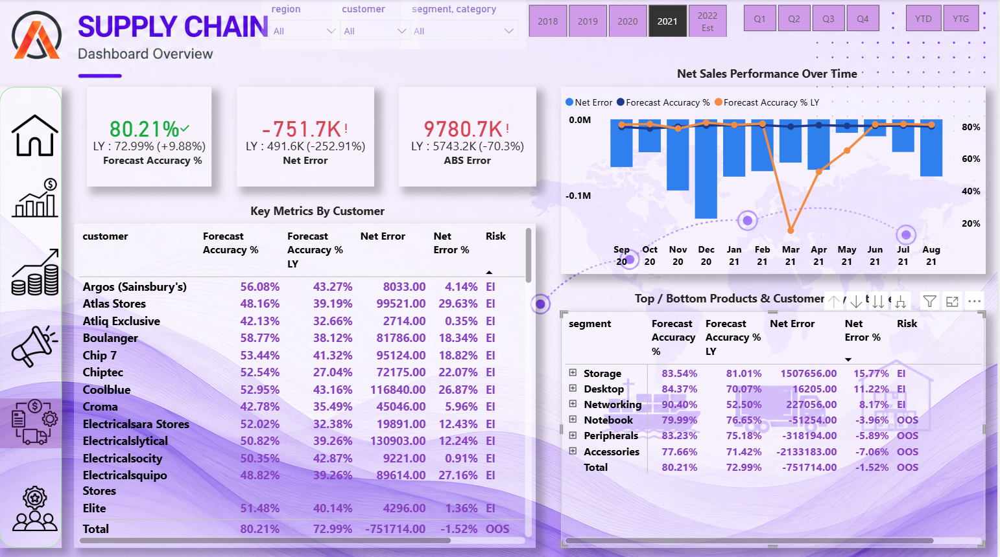
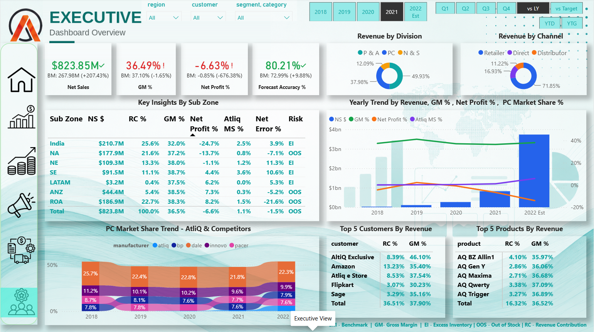
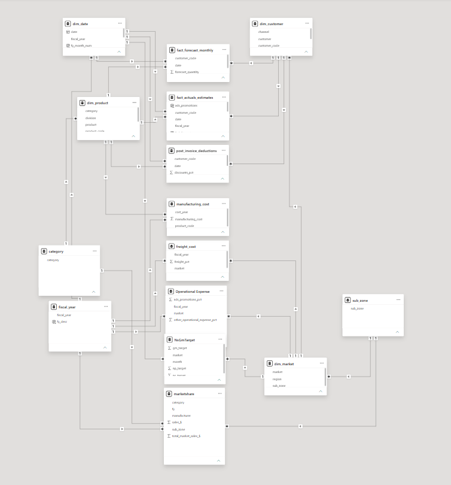

# 📊 Global Business Insights 360

## 🚀 Overview

This project is a complete **end-to-end Power BI Business Intelligence solution** built for a global hardware company (AtliQ Hardware) to replace survey-based, intuition-driven decision-making with a single, connected source of truth across departments.

It focuses on **Finance, Sales, Marketing, Supply Chain, and Executive reporting**, using MySQL, Power Query, and DAX to turn raw transactional data into actionable business insights.

**Motto:** *"Start the day with analysis"*
**Target Audience:** Executives, Finance, Supply Chain, Sales, Marketing teams

---

## 🎯 Business Problem

AtliQ Hardware — a global manufacturer selling PCs, printers, and accessories to clients like Amazon, Walmart, and Croma — was struggling with performance in Latin America. Until this project, all decisions were made using surveys and intuition, with limited Excel-based analysis. As data volume grew, the company needed a scalable, self-serve reporting solution to support accurate, data-backed decisions across every department.

This project solves that using an end-to-end data modeling and dashboarding workflow.

---

## 🛠️ Tech Stack

- **MySQL** → Data storage and querying
- **Power Query** → Data cleaning, transformation, custom dimension tables
- **Power BI (DAX, Data Modeling)** → Snowflake schema modeling, 40+ measures, interactive dashboards
- **DAX Studio** → Formula debugging and performance checks

---

## 📊 Project Workflow

1. Loaded raw data into MySQL and connected it to Power BI
2. Reviewed and removed Power BI's auto-generated relationships; built proper dimension tables in Power Query
3. Validated transformed data against source MySQL/Excel data
4. Built dynamic reference tables (e.g., a self-updating "Last Sales Month" table)
5. Created calculated columns (e.g., fiscal_year) and merged tables in Power Query
6. Modeled the data using a **snowflake schema**, normalizing dimension tables into related sub-dimension tables and connecting them to the fact tables
7. Built 40+ DAX measures for P&L, forecasting, and YoY analysis
8. Optimized the report/file size for easier sharing and access

---

## 📈 Dashboard Preview

### 🟦 Home Page


### 🟩 Finance View

P&L statements, YoY comparisons, top/bottom performing products and customers, benchmarking vs Last Year and vs Target.

### 🟦 Sales View

Customer and product performance, regional drill-downs, and a profitability/growth matrix.

### 🟧 Marketing View

Gross Margin %, Net Profit %, Operational Expenses, and COGS at the product/segment level for budget decisions.

### 🟪 Supply Chain View

Forecast accuracy, net error tracking, and inventory risk flags (Excess Inventory vs Out of Stock).

### 🟩 Executive View

Consolidated KPIs — Net Sales, RC%, GM%, NP%, Forecast Accuracy%, Market Share% — for leadership-level decision-making.

---

## 🗂️ Data Model



A **snowflake schema** was used for this model. Core fact tables (fact_actuals_estimates, fact_forecast_monthly) connect to primary dimension tables (dim_date, dim_product, dim_customer, dim_market), which are further normalized into related sub-dimension tables — e.g., dim_product → category, dim_date → fiscal_year, and dim_market → sub_zone. This structure reduces data redundancy and keeps each dimension's attributes cleanly separated.

---

## 📌 Key Insights

- Despite **$823.85M** in Net Sales, Net Profit % sat at **-6.63%** — a margin problem, not a revenue problem
- **LATAM contributed just 0.4%** of total Revenue Contribution, confirming the original business concern was real
- **Accessories** had the weakest forecast accuracy (**77.66%**) among product segments, driving excess stockout risk
- Overall Forecast Accuracy improved **+9.88% YoY** (72.99% → 80.21%)

> Full breakdown available in [insights/key_findings.md](insights/key_findings.md)

---

## 💡 Business Recommendations

- Investigate operating costs before chasing more revenue — the margin problem needs a cost-side fix, not just a sales push
- Prioritize forecasting improvements for **Accessories**, given both weak accuracy and stockout risk
- Re-audit high-revenue, low-margin markets rather than focusing only on low-revenue regions like LATAM
- Use the best-performing segment's forecast accuracy as an internal benchmark for others

---

## ⚙️ Power BI Features Used

- Data Modeling (Snowflake Schema)
- 40+ DAX Measures — see [docs/DAX_Measures.md](docs/DAX_Measures.md)
- Bookmarks & Navigation Buttons (view switching, vs LY / vs Target toggle)
- Dynamic Titles (SELECTEDVALUE, HASONEVALUE)
- Tooltips
- Conditional formatting for blank/filtered results
- Dynamic Last Refresh Date

---

## 📁 Project Structure

```
Global-Business-Insights-360/
│
├── README.md                     # Project overview (this file)
├── LICENSE                       # MIT License
├── .gitattributes                # Git LFS config for tracking the .pbix file
│
├── Project File.pbix             # Power BI project file
│
├── docs/
│   ├── DAX_Measures.md           # All 40+ DAX formulas, organized by category
│   └── Data_Model.png            # Snowflake schema / data model screenshot
│
├── visuals/
│   ├── 1.home_page.png
│   ├── 2.finance_view.png
│   ├── 3.sales_view.png
│   ├── 4.marketing_view.png
│   ├── 5.supply_chain_view.png
│   └── 6.executive_view.png
│
└── insights/
    └── key_findings.md           # Quick-scan summary of standout business insights
```

---

## 🧠 Learnings

- End-to-end Power BI workflow — from raw data to a 5-view, role-based dashboard
- Snowflake schema data modeling and relationship design
- Writing business-focused DAX for P&L, forecasting, and benchmark logic
- Dashboard storytelling — designing views around what each stakeholder actually needs

---

## ▶️ How to Use

1. Open Project File.pbix in Power BI Desktop
2. Explore interactive visuals across each of the 5 views
3. See [docs/DAX_Measures.md](docs/DAX_Measures.md) for the full list of DAX formulas used
4. See [insights/key_findings.md](insights/key_findings.md) for a quick summary of key business findings

---

## 👤 Author

**Kaushal Gaur**

Data modeling, DAX logic, business interpretation, and dashboard design were independently built and refined over 15 days of hands-on work.

**License:** MIT
